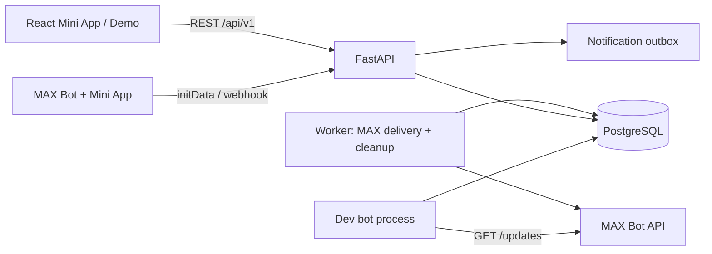

# «Безопасный проход»: аудит и архитектура MVP

## Аудит исходного проекта

Репозиторий содержит асинхронного Python MAX-бота: свой dispatcher/router, handlers жильца/охранника/администратора, FSM в памяти, MAX-клиент на `python-max-bot`, SQLAlchemy 2 async и 2 тестовых файла. BotClient и разбор update уже отделяют часть MAX transport от обработчиков; существующие операции визита и одобрения охранника покрыты тестами.

Ограничения исходного состояния:

- единственный сценарий запускает бот через long polling; HTTP API и Mini App отсутствуют;
- конфигурация по умолчанию использует SQLite, а модель данных описывает только пользователя, заявку и запрос доступа охранника;
- старые статусы `PENDING/APPROVED` расходятся с обязательным `ACTIVE/PASSED` flow;
- общие коды доступа администратора/охранника не дают одноразовых привязанных приглашений;
- нет комплекса, квартиры, КПП, смен, реестра, уведомлений с outbox, очистки, аудита и PostgreSQL migrations;
- SQLite `create_all`/ручное добавление пары колонок сейчас фактически выполняет роль миграций;
- тесты проверяют legacy bot flow, но не межкомплексный доступ, график смен или импорт.

Рабочие части сохраняются: BotClient/dispatcher и старые handlers остаются доступны для совместимости, а новый webhook entry point использует отдельный интеграционный MAX client. Общая бизнес-логика нового API не зависит от MAX SDK.

## Целевая архитектура

Модульный монолит на Python 3.11+, FastAPI, Pydantic, SQLAlchemy 2.x async, Alembic и PostgreSQL. React/TypeScript/Vite служит Mini App и локальным demo UI. API, MAX webhook, outbox worker и cleanup worker запускаются разными процессами из одного образа приложения. Docker Compose поднимает PostgreSQL, API, worker и frontend.

### Доменные модули

- `app/domain`: сущности и правила заявок, расписаний, членства, реестра.
- `app/api`: versioned REST routes, Pydantic schemas и серверные permissions.
- `app/security`: проверка MAX `initData`, demo auth, webhook secret.
- `app/integrations/max`: официальный HTTP API client и обработка webhook update.
- `app/jobs`: доставка outbox, срок действия приглашений и очистка заявок.
- `frontend/src`: страницы ролей, API client, auth/MAX bridge, компоненты и темы.

### Модель данных

`accounts` хранит внешний MAX user ID и пользовательскую активность. Tenant boundary проходит через `complexes`; `complex_admins`, `resident_apartments`, `guard_profiles` и `guard_checkpoints` задают права пользователя. `buildings`/`apartments` и импортированный реестр являются источником подтверждения регистрации жильца. `guard_invites` хранит только хеш одноразового кода.

`checkpoints` принадлежат ЖК. `guard_shifts` содержит повторяющиеся недельные смены и разовые/замещающие интервалы; активная смена вычисляется backend в часовом поясе ЖК, включая переход через полночь. `resident_visit_requests` фиксирует ЖК, квартиру, КПП, жильца и копию его контакта на момент создания, сохраняя старую таблицу `visit_requests` для legacy-бота. Переходы `ACTIVE -> PASSED/REJECTED/CANCELLED/EXPIRED` атомарны; отменённые заявки остаются в истории до 14 дней, pin хранится отдельным флагом. `notifications` является transactional outbox с уникальным ключом доставки; `audit_events` фиксирует административные и статусные действия. `max_webhook_events` защищает обработку update от дублей.

### Авторизация и MAX

Production запросы Mini App передают исходную строку `WebApp.initData`; backend проверяет HMAC-SHA256 подпись по официальному алгоритму MAX, возраст данных и затем загружает аккаунт и его роли из БД. `initDataUnsafe` и пользовательские `role/id` не являются источником доверия. Mock-пользователь доступен только при `DEMO_MODE=true` и `ENVIRONMENT=development`. Webhook проверяет `X-Max-Bot-Api-Secret`; запросы к Bot API используют `platform-api2.max.ru` и `Authorization` header. MAX API ошибки оставляют уведомление в очереди для ограниченных повторов и не откатывают заявку.

## Реализовано в MVP

- PostgreSQL схема, Alembic migrations, development seed и явная настройка начального production администратора через `ADMIN_MAX_USER_ID`.
- Серверная MAX авторизация, регистрация жильца по реестру, одноразовые приглашения охраны и роли.
- Заявки, смены и замены, атомарная обработка, поиск, история, pin/cancel и transactional outbox.
- Admin API для реестра XLSX (preview/confirm), жильцов, охраны, КПП, смен и журнала действий.
- MAX webhook, запуск Mini App, уведомления, повторы и очистка данных по срокам хранения.
- Development Long Polling в отдельном Compose-профиле `max-long-polling`; MAX webhook и polling взаимоисключаются.
- Mobile-first Mini App с переключением demo-профилей, Docker Compose, OpenAPI и инструкции.

## Ограничения развёртывания MAX

Mini App URL должен быть HTTPS и зарегистрирован в настройках связанного бота на платформе MAX. Production webhook принимает HTTPS на порту 443 с доверенным сертификатом; для локального получения bot updates без публичного endpoint используйте Long Polling, а для Mini App внутри MAX всё равно требуется HTTPS URL. Long Polling допустим только в development и только без активной webhook-подписки. Один пользователь должен сначала открыть чат/бота в MAX, чтобы бот мог направить ему личное уведомление. Платформенные настройки, токены и доступность production TLS невозможно проверить из локального репозитория.
